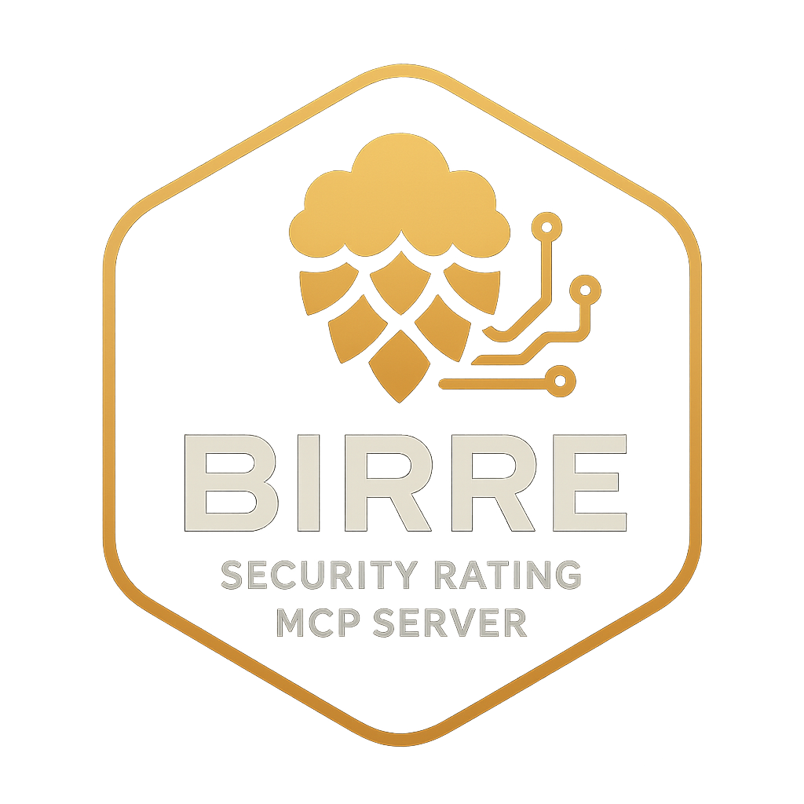

<div align="center">

</div>

**BiRRe** (*Bi*tsight *R*ating *Re*triever) is a Model Context Protocol (MCP) server that provides access to BitSight security rating data through an existing subscription.
It utilizes [FastMCP](https://gofastmcp.com/) for API integration and can be run easily without installation in a temporary, isolated Python environment with uv.

## Installation

### Quick start

- Set your BitSight API key, then start BiRRe:

```bash
export BITSIGHT_API_KEY="your-bitsight-api-key"
uvx --from git+https://github.com/boecht/birre server.py run
```

- Point your LLM of choice to the MCP server and ask it for the BitSight rating of any company.
- Explore the CLI with the added `--help` flag or consult [docs/CLI.md](docs/CLI.md). Individual subcommands such as `run` and `healthcheck` also provide dedicated `--help` output.

### Configuration

Configuration sources (lowest → highest): `config.toml` → `config.local.toml` → environment → CLI.
See the descriptions in `config.toml` for available fields and details. For CLI options, run with `--help` or consult [docs/CLI.md](docs/CLI.md).

### Run directly from GitHub with uvx

```bash
uvx --from git+https://github.com/boecht/birre server.py run
```

### Or run locally

```bash
git clone https://github.com/boecht/birre
uv run server.py run
```

That's it! The script will automatically install all dependencies using uv.

## Disclaimer

**BiRRe** (*Bi*tsight *R*ating *Re*triever) is **not affiliated with, endorsed by, or sponsored by BitSight Technologies, Inc.** This is an unofficial, community-developed MCP server that provides integration with Bitsight's publicly available services.

- This project is developed and maintained independently by the open source community
- "Bitsight" is a registered trademark of BitSight Technologies, Inc.
- This integration is provided "as-is" without any warranty or official support from BitSight Technologies, Inc.

This project enables third-party access to Bitsight services through their public APIs and is intended for educational and integration purposes only.

## Features

### Available Tools

BiRRe supports context-specific toolsets:

- **`standard` context (default)** – quick rating workflows
  - `company_search`: Search BitSight for companies by name or domain
  - `get_company_rating`: Retrieve security ratings with automatic subscription management
- **`risk_manager` context** – subscription and onboarding operations
  - `company_search_interactive`: Enriched search results (name + GUID, domains, description, employee count, subscription folders) for human-in-the-loop selection
  - `manage_subscriptions`: Bulk subscribe/unsubscribe GUIDs with dry-run support and audit summaries
  - `request_company`: Submit BitSight company requests (deduplicates existing requests, attempts v2 bulk workflow with folder targeting, falls back gracefully)
  - regular `company_search` and `get_company_rating` remain available for spot checks

Select a context via `--context`, `BIRRE_CONTEXT`, or the `[runtime].context` config key.

## BitSight API Documentation (v1 + v2 are complementary)

**API Version**: This implementation is based on BitSight APIs as of July 24th, 2025. For the latest API changes and updates, refer to the [BitSight API Change Log](https://help.bitsighttech.com/hc/en-us/articles/231655907-API-Change-Log).

**Interactive API Documentation** (requires BitSight account login):

- **v1 API**: <https://service.bitsighttech.com/customer-api/v1/ui> (383 endpoints)
- **v2 API**: <https://service.bitsighttech.com/customer-api/v2/ui> (20 enhanced features)

**Schema Updates**: To update API schemas when forking or contributing:

1. Log into BitSight web interface
2. Download schemas from:
   - **v1**: <https://service.bitsighttech.com/customer-api/ratings/v1/schema>
   - **v2**: <https://service.bitsighttech.com/customer-api/ratings/v2/schema>  
3. Save as `apis/bitsight.v1.schema.json` and `apis/bitsight.v2.schema.json`

## Version History and Outlook

### Version 1.0: MVP

- **Company Search**: Search for companies by name or domain via API v1 `companySearch`
- **Company Rating**: Retrieve core rating details with automatic subscription management
- **Ephemeral Subscriptions**: Subscribe/unsubscribe on demand to avoid license leakage
- **Structured Error Handling**: Clear responses for quota/subscription failures
- **uv/uvx Compatible**: Run easily with uv using PEP 723 inline script metadata

### Version 2.0: Top Vulnerability Insights

- **Top Findings Summary**: Attach the most impactful vulnerabilities to the rating payload, using relaxed severity filters (severe/material first, then moderate with web-appsec padding when needed)
- **Enhanced Sorting**: Prioritise findings by severity, asset importance, and recency to keep the worst issues on top
- **Narrative Improvements**: Normalise detection/remediation text for quick consumption by MCP clients

### Version 3.0: Context Modes (Current)

- Two personas: `standard` (quick ratings) and `risk_manager` (subscription operations)
- Context-driven tool filtering via CLI (`--context`), env (`BIRRE_CONTEXT`), or config
- Risk manager tooling delivers enriched search data, dry-run batch subscription workflows, and company onboarding requests without in-tool prompts (LLMs coordinate user confirmations)

### Version 4.0: Caching Layer (Not Implemented)

- Daily caching of ratings and reusable storage for PDF artifacts
- Reduce duplicate API calls and avoid re-downloading recent reports

### Version 5.0: Company Reports (Not Implemented)

- Download official PDF reports
- Deliver via direct attachment, email, or configured file share (POSIX path or SharePoint)

### Version 6.0: Multi-Tenant Service (Not Implemented)

- Remote deployment support
- Authentication and authorization
- Concurrent user support

## Testing

### Pytest

BiRRe ships with both offline unit tests and opt-in live integration checks. The
offline suite exercises configuration layering, logging formatters, startup
checks, subscription helpers, and both standard and risk-manager tools without
touching the BitSight API. The live tests drive the FastMCP client end-to-end
against BitSight and require real credentials.

```bash
# Run the offline suite (no network calls).
uv run pytest -m "not live"

# Run the live smoke tests against BitSight.
uv run pytest -m live -rs
```

Live tests require a valid `BITSIGHT_API_KEY` in the environment (or
`config.local.toml`) and the `fastmcp` client dependency, which `uv run` will
install on demand inside an isolated virtual environment.

### Healthcheck

Use the built-in health check to validate your environment before connecting a
client. The command mirrors the `run` startup sequence, reporting resolved
configuration and exercising BitSight connectivity, subscription, and tooling
checks in standard online mode. When invoked with `--offline`, the network calls
are skipped while configuration and logging validation continue.

```bash
# Run the full diagnostics against the default BitSight test endpoint.
uv run server.py healthcheck

# Skip remote calls while validating local configuration.
uv run server.py healthcheck --offline
```

Successful runs exit with code `0`. Failures return `1`, and partial results
with warnings (for example, optional tooling gaps in offline mode) return `2`.
